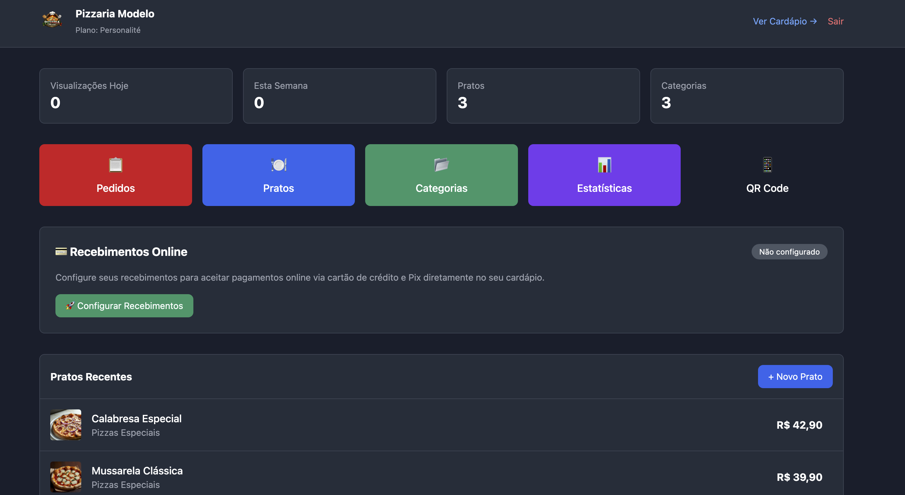
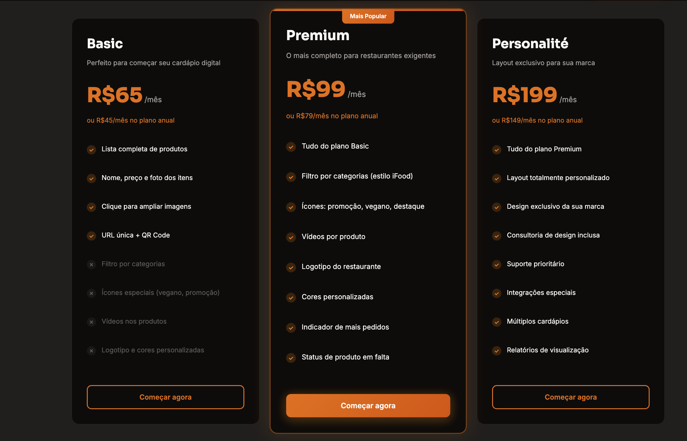
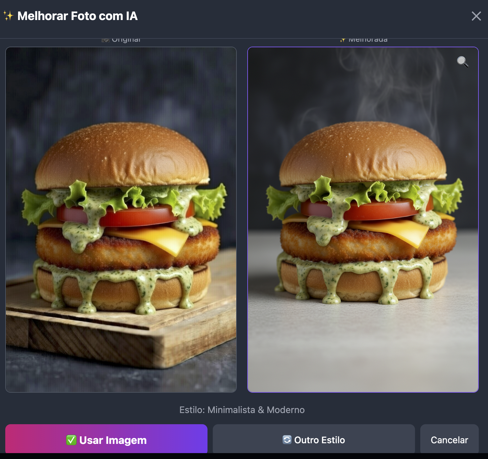

# Menu Masters

Digital menu and restaurant operations platform focused on onboarding, ordering flow, and business management.

## Overview

Menu Masters is a product-oriented platform built to support restaurant operations through a digital menu experience and internal management workflows.

The project was designed with a practical SaaS mindset, combining user experience, onboarding, configuration flows, business management, and visual optimization features in one product.

## Screenshots

### Dashboard

### Pricing / Commercial Structure

### AI Photo Enhancement

## What this project includes

- Digital menu structure
- Restaurant onboarding flows
- Operational dashboard
- Product and category management
- QR code menu experience
- Online payment readiness
- AI-assisted visual enhancement for food images
- SaaS-oriented product architecture

## Why it matters

This project reflects a practical product engineering approach focused on real business workflows.

Instead of building generic demos, the focus here is on solving concrete operational needs for restaurants:
- improve ordering experience
- simplify onboarding
- support internal management
- strengthen commercial packaging
- create a scalable product foundation

## Tech stack

- TypeScript
- React
- Vite
- Tailwind CSS
- Supabase
- SaaS-oriented frontend architecture

## Current status

Public portfolio version of a real product.

This repository is being organized to better represent the product, interface, and engineering decisions behind the platform.

## Author

Vitor Caponi  
Product Engineer building AI systems, automation workflows, and SaaS products.
